<h3><code>khachik@github ~ $ ./contributions.sh</code></h3>

  

<h3><code>khachik@github ~ $ whoami</code></h3>

<table>
  <tr>
    <td valign="top"></td>
    <td valign="top"></td>
  </tr>
</table>

  

<h3><code>khachik@github ~ $ ./links.sh</code></h3>

<b>Full-Stack Developer · React · Node.js · TypeScript</b>

 

  

<i>“Turning ideas into beautiful code.”</i>

